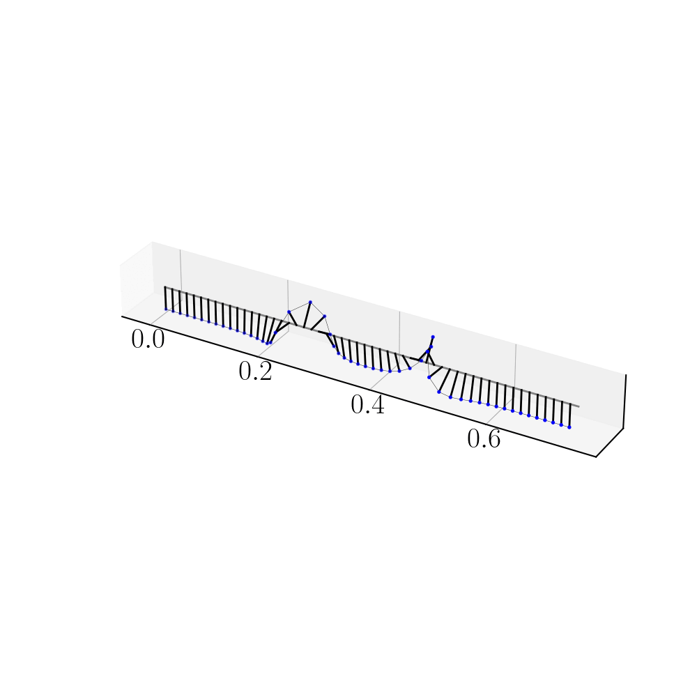
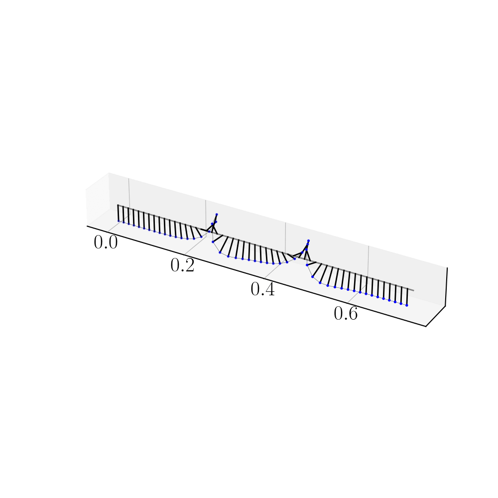
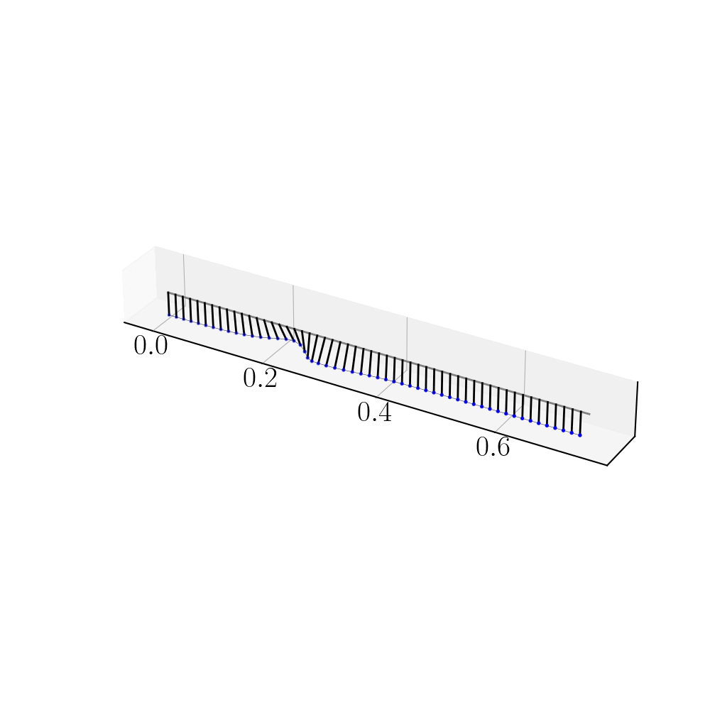

# Solitons

## Spring-coupled pendulum chain

[Python Jupyter Notebook to compute the FDTD and plot animations](FDTD_Animation.ipynb)

[Python Jupyter Notebook to compute the FDTD and plot imshows](FDTD_Imshow.ipynb)

[Python script to control stepper motors from a Raspberry Pi card](Stepper_motor.py)

### Moving kink (experience)

### Kink and kink

### Kink and antikink

### Moving kink and static kink

### Antikink with free end

### Breather

